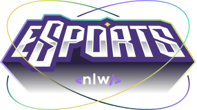

<p align="center">
  
</p>

<br>

<p align="center">
  Project developed during the **eSports** edition of Rocketseat's NLW 
</p>

<br>

<!-- The web client is deployed on Vercel here:

The server is deployed on Fly here: 

-->

<hr>
<br>

  - [Description](#description)
  - [Stack and tools](#stack-and-tools)
  - [Quickstart](#quickstart)

<br>
<hr>
<br>

## Description

The project is called *Find your Duo*.
It is a platform to find the perfect partner to play your favorite game together.

<br>

## Stack and tools

* [Node.js](https://nodejs.org/en/)
* [Prisma](https://www.prisma.io/)
* [React](https://reactjs.org/)
* [React Native](https://reactnative.dev/)
* [Expo](https://expo.dev/)
* [Figma](https://www.figma.com/)
* [Radix UI](https://www.radix-ui.com/)

<br>

## Quickstart

### - Server

First, create a new ``.env`` file on the root directory, using the `.env.example` template as base.

Then, to create the local db run:
```sh
$ npm install
$ npm run db:migrate
```

After that, to start the server, run:
```sh
$ npm run dev
```

### - Web

To run the local Vite web client:
```sh
$ npm install
$ npm run dev
```
